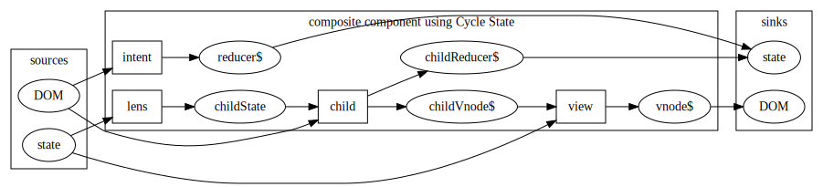

# A peek at CycleJS

"Slides" for the [MalmöJS React alternatives meetup](https://www.meetup.com/MalmoJS/events/270297128/) peek into CycleJS!

Available at [https://github.com/krawaller/cycle-example-covid](https://github.com/krawaller/cycle-example-covid) (along with example source)

## Example app

Source code in this repo

Published live at [https://malmojs-cycle.netlify.app/](https://malmojs-cycle.netlify.app/)

### Example app apologies

For ease of showing code, I have

- many files
- verbose typings
- very religious patterns

Real app would be way more succinct

## Reactive programming

You've probably seen [this gist](https://gist.github.com/staltz/868e7e9bc2a7b8c1f754) by André Staltz!

His framework takes the dog **VERY** literally.

## CycleJS

Been around for quite a while!

Staltz' [talk at ReactConf 2015](https://www.youtube.com/watch?v=uNZnftSksYg)

Also

- [Official page](https://cycle.js.org/)
- [Egghead course](https://egghead.io/series/cycle-js-fundamentals)

### Totally stream based

Uses [xstream](http://staltz.github.io/xstream/) internally (for now)

...but there are adapters for RXJS, etc

### CycleJS basic flow

- **Components**: Your programs! Pure functions.
- **Drivers**: Where side effects happen
- **Sources**: Obj of streams, input to components
- **Sinks**: Obj of streams, output from components

### Drivers

Each **driver** operates on a key in the sources/sinks.

An important example is the **DOM driver**:

- `sources.DOM` lets you catch events
- `sinks.DOM` is a stream of vnodes (to be rendered)

### Homemade drivers

The example app has two home-made drivers:

- `logDriver` logs every new state emission
- `localStorageDriver` saves/loads to LS

### CycleJS Components

Components are composable

### Example app structure

Component tree:

### The MVI pattern

Internally a component will commonly use the [Model View Intent pattern](https://cycle.js.org/model-view-intent.html)

The `ConfirmButton` component in example adheres to this.

### Fractal state approach

[Cycle State API](https://cycle.js.org/api/state.html)

Outermost component has entire state (like redux store)

### Lenses

Adapted for child component via lenses

### MVI pattern with Cycle State

Most example components look like this.

### Composite Component

### CycleJS future

- NeoCycle
- Callbags
