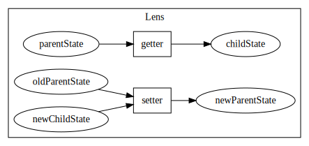

# A peek at CycleJS

"Slides" for the [MalmöJS React alternatives meetup](https://www.meetup.com/MalmoJS/events/270297128/) peek into CycleJS!

Available at [https://github.com/krawaller/cycle-example-covid](https://github.com/krawaller/cycle-example-covid) (along with example source)

## Example app

Source code in this repo

Published live at [https://malmojs-cycle.netlify.app/](https://malmojs-cycle.netlify.app/)

## Reactive programming

You've probably seen [this gist](https://gist.github.com/staltz/868e7e9bc2a7b8c1f754)!

This framework takes the dog literally.

## CycleJS

Been around for quite a while!

Staltz' [talk at ReactConf 2015](https://www.youtube.com/watch?v=uNZnftSksYg)

Also

- [Official page](https://cycle.js.org/)
- [Egghead course](https://egghead.io/series/cycle-js-fundamentals)

### CycleJS basic flow

But `app` will likely have inner components too.

### CycleJS Components

- `sources` is an object with streams (and sometimes other things)
- `sinks` is an object with streams

### The MVI pattern

Internally a component will commonly use the [Model View Intent pattern](https://cycle.js.org/model-view-intent.html)

### Fractal state approach

[Cycle State API](https://cycle.js.org/api/state.html)

Outermost component has entire state (like redux store)

### Lenses

Adapted for child component via lenses

